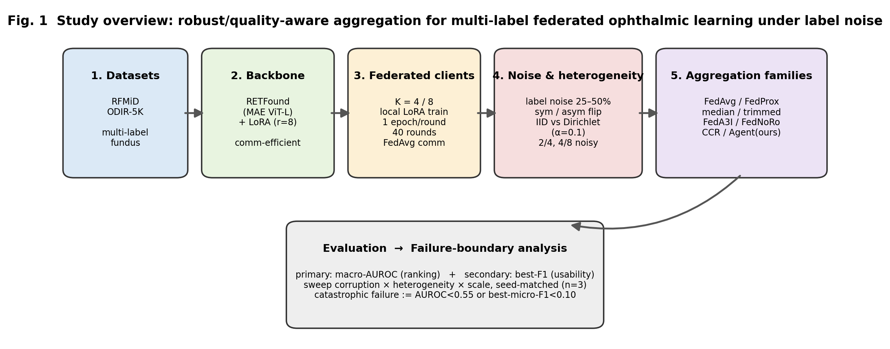
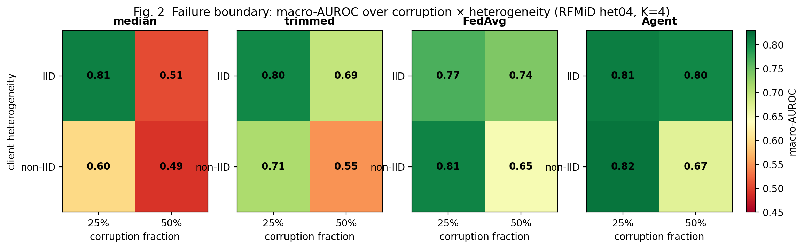
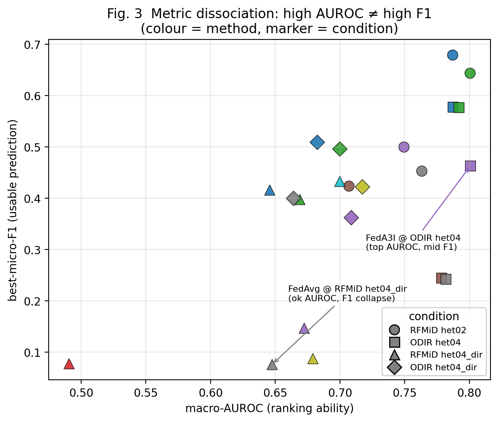
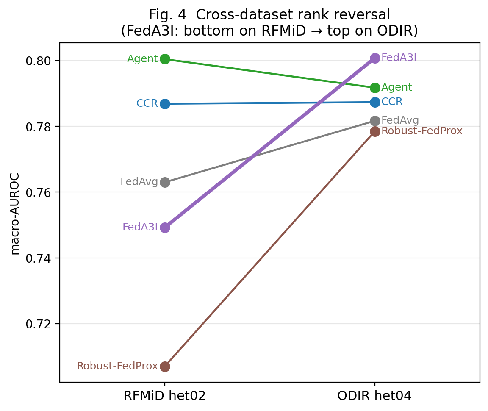
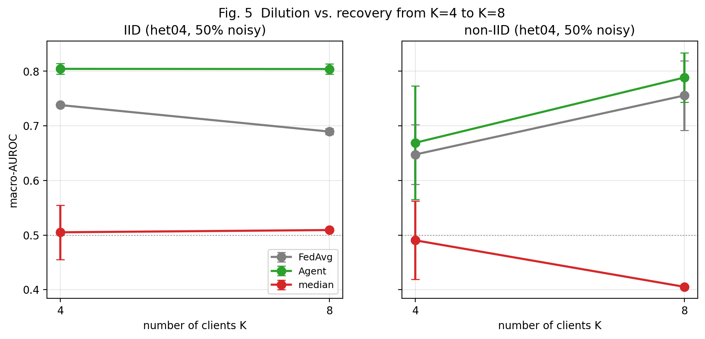
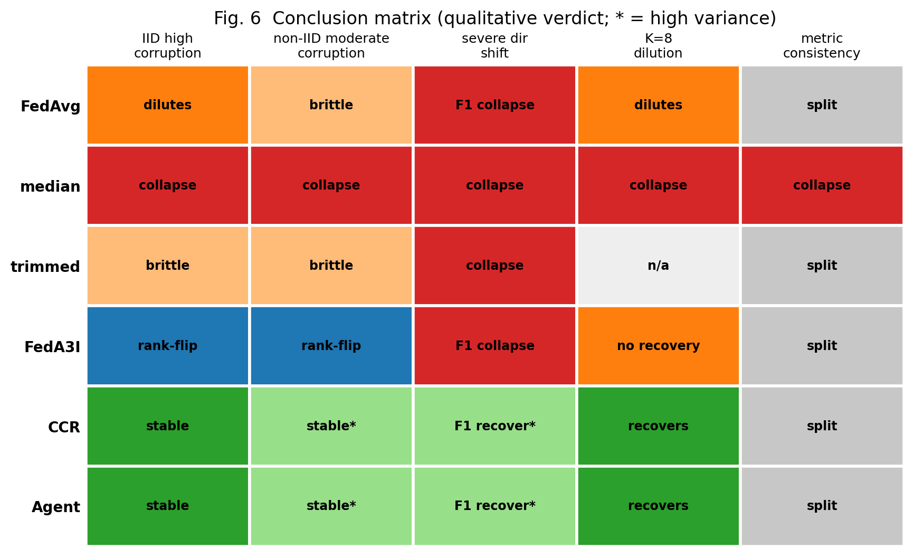

# Failure Boundaries of Robust and Quality-Aware Aggregation in Multi-Label Federated Ophthalmic Learning

*(alt. title: "When Robust Aggregation Fails: An Empirical Study of
RETFound–LoRA Multi-Label Federated Ophthalmic Learning under Label Noise")*

> **Central thesis (one-line message):** *Robust aggregation in medical
> multi-label FL is governed by **failure boundaries**, not by a universal
> winner — its usefulness is conditional on dataset, corruption fraction,
> heterogeneity, scale, and the metric one reads.*
>
> 完整初稿(**MIDL-oral 定位改写版**),基于已落盘 3-seed 结果,正文数字均为实测,无占位符。
> MIDL 2025 scope 命中:*foundation models · federated learning · learning with noisy labels ·
> validation studies · safe/trustworthy learning · ophthalmology*。FedNoRo 与非对称噪声为
> **已实现在跑**的扩展(§7)。英文正文 + 中文旁注(投稿删旁注)。
> 数据来源:RFMiD supp / ODIR / scale 三份 3-seed CSV + `agent_stage1`(het04 50% 锚点)。

---

## Abstract

**Problem.** Federated learning (FL) for multi-label fundus diagnosis must cope
with heterogeneous clients whose labels are noisy — precisely the setting where a
growing set of "robust" aggregators promise resilience.
**Gap.** Yet these methods are almost always validated on natural-image
single-label benchmarks with synthetic IID corruption and a single dataset/metric;
whether they transfer to foundation-model, multi-label, multi-centre ophthalmic FL
is untested.
**Approach.** Using RETFound with LoRA on two public retinal datasets (RFMiD,
ODIR-5K), we run a controlled, seed-matched benchmark of four aggregation families
— vanilla/proximal averaging (FedAvg, FedProx), Byzantine-robust (coordinate-median,
trimmed-mean), quality-aware (FedA3I; FedNoRo), and probe/confidence reweighting
(CCR/RHFL and an adaptive probe-gated variant) — sweeping corruption fraction
(25–50% noisy clients), non-IID (Dirichlet) heterogeneity, and client scale
(K=4, K=8), ranking by threshold-free macro-AUROC with F1 as a usability metric.
**Findings.** No aggregator wins universally; instead each is bounded by a *failure
boundary*: (i) quality-aware aggregation **inverts rank across datasets** (FedA3I
is bottom-tier on RFMiD, top-ranked on ODIR); (ii) coordinate-median fails along a
**two-dimensional boundary** — it recovers within its `n≥2f+1` tolerance under IID
splits but stays unreliable under non-IID splits even at 25% corruption, exposing
heterogeneity as a second, independent stressor; and (iii) macro-AUROC and F1
rankings **frequently disagree**, so single-metric superiority claims are unsafe.
Reference-based reweighting degrades most gracefully across corruption and scale.
**Recommendation.** Robust-FL for medical imaging should be evaluated by
stress-testing heterogeneity × corruption and reporting AUROC *and* F1, rather than
by average-case single-benchmark rankings. We release the benchmark and a
one-command reproduction pipeline.

---

## 1. Introduction

Collaborative training across hospitals is attractive for retinal diagnosis
because no single centre holds enough labelled, disease-diverse fundus images,
yet privacy prevents pooling raw data. Federated learning (FL) addresses this,
but real multi-centre data are **noisily labelled** (inter-grader disagreement,
under-reporting of secondary findings) and **non-IID** (each centre sees a
different disease mix). A large body of "robust aggregation" methods —
Byzantine-robust statistics, quality-aware weighting, confidence reweighting —
claims to protect the global model under such conditions.

However, most of these claims are established on natural-image single-label
benchmarks with synthetic IID corruption, small models trained from scratch, and
a single dataset/metric. Whether they transfer to the setting that matters for
retinal diagnosis — **a pretrained foundation model (RETFound) fine-tuned with
LoRA, on multi-label fundus data, with structured label noise, non-IID splits,
and realistic client counts** — is largely untested.

This paper does not propose a new aggregation mechanism. Instead we contribute a
**rigorous empirical study and failure-boundary characterization**. We evaluate
four aggregation families under a controlled matrix of corruption fraction,
heterogeneity, and scale, on two datasets, using a threshold-free primary metric
and strict seed-matching. Our findings show that "robustness" is far more
conditional than the literature implies: the *ranking* of methods changes with
the dataset, robust statistics fail along a two-dimensional boundary, and
conclusions flip depending on whether one reads AUROC or F1.

**Contributions.**
1. A unified, seed-matched benchmark of four aggregation families for multi-label
   medical FL under label noise, on two datasets and two client scales, with a
   foundation-model + LoRA backbone — a regime where robust-FL claims have not
   been validated.
2. **Cross-dataset non-transferability** of quality-aware aggregation: FedA3I's
   rank inverts between RFMiD (bottom) and ODIR (top).
3. A **two-dimensional failure boundary** for Byzantine-robust aggregation:
   coordinate-median's collapse is governed by *both* corruption fraction and
   client heterogeneity, isolated with within-spec (25%) vs over-bound (50%)
   controls under IID and non-IID splits.
4. **Metric-dimension dissociation** as a first-class finding: AUROC (ranking)
   and F1 (usable prediction) routinely disagree, motivating mandatory
   dual-metric reporting in robust FL.
5. A fully reproducible pipeline (data → split → matrix → summary/figures), with
   all configs and seeds released.

---

## 2. Related work

**Federated aggregation.** FedAvg [McMahan et al., 2017] averages client updates
by data size; FedProx [Li et al., 2020] adds a proximal term for heterogeneity.

**Byzantine-robust aggregation.** Krum [Blanchard et al., 2017], coordinate-wise
median and trimmed-mean [Yin et al., 2018] tolerate a bounded fraction `f` of
arbitrarily corrupted clients (`n≥2f+1`), assuming honest updates concentrate.

**Robust / quality-aware FL under label noise.** RHFL/CCR [Fang & Ye, CVPR 2022]
reweights clients by confidence; FedA3I [Wu et al., AAAI 2024] estimates client
annotation quality from a per-sample loss GMM; FedNoRo [Wu et al., IJCAI 2023]
uses a two-stage schedule (warmup, then a robust loss on identified-noisy
clients). These are our primary comparison points.

**Foundation models for retina.** RETFound [Zhou et al., Nature 2023] is an
MAE-pretrained ViT for fundus/OCT; LoRA [Hu et al., 2022] enables
communication-efficient federated fine-tuning.

**Gap.** No prior work jointly evaluates these families under *foundation model +
LoRA + multi-label medical + label noise + non-IID + scale* with a dual-metric,
seed-matched protocol; nor reports the cross-dataset rank inversion or the
two-dimensional robust-aggregation failure boundary that we identify.

---

## 3. Method and experimental design

### 3.1 Backbone and federated setup

We fine-tune RETFound (MAE-pretrained ViT-Large) with LoRA (rank 8, α=16) on the
attention/MLP linear layers; only LoRA adapters and the classification head are
communicated each round (we account upload bytes per round). Clients run one
local epoch per round for 40 rounds; loss is class-balanced BCE. Unless stated,
K=4 clients.

### 3.2 Aggregation families evaluated

- **FedAvg** — size-proportional averaging (anchor).
- **FedProx / robust-FedProx** — proximal regularization to the global model.
- **Byzantine-robust** — coordinate-median and trimmed-mean (trim ratio 0.25).
- **Quality-aware** — **FedA3I** (per-sample loss GMM → quality × size weighting).
  *(FedNoRo, a two-stage warmup + robust-GCE-on-noisy variant, is implemented and
  running; see §7.)*
- **Probe/confidence reweighting** — **CCR/RHFL** (softmax over client confidence)
  and our **adaptive agent**: a sigmoid gate on a held-out probe-validation score
  centred on the median client score, so equally-good clients reduce to FedAvg
  while clearly-worse clients are down-weighted; optional variants add adaptive
  per-client μ and a weight-floor.

### 3.3 Noise, heterogeneity, scale

Label noise is injected on a subset of clients (the "noisy" clients) by symmetric
multi-label flipping at rate p. Conditions: **het02** (p=0.2, 2/4 noisy),
**het04** (p=0.4, 2/4 = 50% noisy), and low-corruption controls **het04lo**
(p=0.4, 1/4 = 25% noisy). Partitions are **IID** or **Dirichlet (α=0.1)**
non-IID. Scale is **K=4** and **K=8** (4/8 noisy, same 50% fraction).
*(A second, asymmetric class-conditional noise model is running; see §7.)*

### 3.4 Evaluation protocol (护城河段)

We rank all methods by **macro-AUROC**, which is threshold-free and stable across
seeds. Threshold-tuned F1 (`best-micro/macro-F1`) is reported for usability but
**not** used for ranking, because it is high-variance under the extreme label
imbalance of multi-label fundus data (even FedAvg's best-micro-F1 swings by ±0.08
across seeds). All comparisons are **seed-matched**: methods in a row share
client partitions, noise realizations, and seeds. We report mean ± std over
3 seeds unless noted.

> 中文:这段先声明"F1 抖、只用 AUROC 排名、同种子对比",挡住后面单看 F1 的质疑。

### 3.5 Statistical presentation and failure definition

Every reported cell is **n=3 seeds** (mean ± std) unless explicitly annotated
otherwise (two-seed cells and single-seed points are marked). Because sample
sizes are small, we report **effect sizes** rather than p-values: for a
comparison we give the mean difference Δ and, where relevant, a
standardized-mean-difference proxy `Δ / s_pooled` with
`s_pooled = sqrt((s_A² + s_B²)/2)`; we call an effect **decisive** only when
`|Δ| > 2·s_pooled` (roughly non-overlapping ±1σ bands) and otherwise report it as
*trend-consistent* (e.g. the K=8 non-IID recovery, §4.4).

We define **catastrophic failure** operationally: a method fails on a condition
if its macro-AUROC `< 0.55` (near the 0.5 random floor) **or** its best-micro-F1
`< 0.10` (predictions unusable). Under this definition coordinate-median fails on
every 50% condition and on non-IID 25% (Table 2), and FedAvg/FedA3I suffer an
F1-only failure on RFMiD het04_dir (Table 3a) despite non-failing AUROC — the
metric dissociation of §4.5.

> 中文:gap 4 补齐——n=3 明示、效应量 `Δ/pooled-std`、以及"灾难性失败"的硬定义
> (AUROC<0.55 或 best-micro-F1<0.10)。审稿人问统计严谨性时直接引用本段。

---

## 4. Results

> 图见文末 §9。核心图:Fig.2 失败边界热图、Fig.3 AUROC–F1 分裂散点、Fig.4 跨数据集排名翻转、
> Fig.5 K 稀释-恢复、Fig.6 结论矩阵。

### 4.1 RQ1 — Does the best aggregator transfer across datasets?

**Answer: No.** The competitiveness of quality-aware aggregation is
dataset-dependent, and rank order inverts between the two datasets (Fig. 4).

On **RFMiD het02** (p=0.2, 2/4 noisy), probe/confidence reweighting leads and
FedA3I trails FedAvg:

**Table 1a — RFMiD het02, macro-AUROC (rank) / best-micro-F1 (ref)**

| Method | macro-AUROC | best-micro-F1 (ref) | seeds |
|---|---|---|---|
| Robust-FedProx | 0.7069 ± 0.0014 | 0.424 ± 0.015 | 2 |
| FedA3I | 0.7492 ± 0.0088 | 0.500 ± 0.085 | 3 |
| FedAvg | 0.7630 ± 0.0002 | 0.453 ± 0.148 | 2 |
| CCR (RHFL) | 0.7869 ± 0.0107 | 0.679 ± 0.019 | 3 |
| **Agent (ours)** | **0.8005 ± 0.0114** | 0.644 ± 0.026 | 2 |

On **ODIR het04** (p=0.4, 2/4 noisy), the ranking **inverts** — FedA3I tops AUROC:

**Table 1b — ODIR het04, macro-AUROC (rank) / best-micro-F1 (ref)**

| Method | macro-AUROC | best-micro-F1 (ref) | seeds |
|---|---|---|---|
| Robust-FedProx | 0.7785 ± 0.0103 | 0.245 ± 0.003 | 3 |
| FedAvg | 0.7817 ± 0.0229 | 0.242 ± 0.027 | 3 |
| CCR | 0.7874 ± 0.0199 | 0.578 ± 0.013 | 3 |
| **Agent (ours)** | 0.7918 ± 0.0054 | **0.577 ± 0.009** | 3 |
| **FedA3I** | **0.8008 ± 0.0094** | 0.463 ± 0.047 | 3 |

**Finding.** FedA3I is bottom-tier on RFMiD het02 (below FedAvg on AUROC) but the
top method on ODIR het04. This **dataset-dependent reordering** of a quality-aware
baseline is a key empirical result and cautions against single-dataset aggregator
claims. Note also that FedA3I's ODIR AUROC lead does *not* translate to F1 (0.463
vs Agent/CCR ≈0.58) — a first instance of the metric split we return to in §4.5.

### 4.2 RQ2 — Is Byzantine-robust aggregation a safe default under label noise?

**Answer: No — it fails along a two-dimensional boundary** set jointly by
corruption fraction and client heterogeneity (Fig. 2).

Coordinate-median / trimmed-mean tolerate `<50%` corrupted clients (`n≥2f+1`).
We sweep corruption fraction under IID and non-IID splits (RFMiD, K=4). FedAvg and
Agent anchors are 3-seed.

**Table 2a — IID (het04), macro-AUROC**

| Corruption | median | trimmed | FedAvg | Agent |
|---|---|---|---|---|
| 25% (1/4, within spec) | **0.8096 ± 0.0097** | 0.8047 | 0.7665 | 0.8113 |
| 50% (2/4, at/over bound) | **0.5051 ± 0.0498** | 0.6937 | 0.7380 ± 0.0007 | 0.8043 ± 0.0096 |

**Table 2b — non-IID (het04_dir, α=0.1), macro-AUROC**

| Corruption | median | trimmed | FedAvg | Agent |
|---|---|---|---|---|
| 25% (within spec) | **0.5978 ± 0.1854** | 0.7100 | 0.8068 | 0.8191 |
| 50% (at/over bound) | **0.4904 ± 0.0716** | 0.5487 | 0.6475 ± 0.0546 | 0.6690 ± 0.1040 |

**Finding.** Median's failure is governed by **two** stressors:
- *IID:* dropping corruption 50%→25% restores it (0.505→0.810, near-zero std) —
  a clean **breakdown-point** crossover consistent with `n≥2f+1`.
- *non-IID:* even at 25% corruption it is **unreliable** (0.598 ± 0.185, seed-to-
  seed swings ~0.4–0.78, vs a stable FedAvg 0.807) — client heterogeneity is a
  *second, independent* stressor.

The severity gradient is **median (most brittle) < trimmed < agent (most
stable)**. Because corrupted fractions and heterogeneity levels common in
multi-centre medical FL routinely fall outside median's viable regime, robust
statistics can be an actively harmful default here; adaptive reweighting degrades
gracefully instead.

### 4.3 RQ3 — Under severe non-IID + noise, does reweighting "recover" performance?

**Answer: Only on F1, and unstably** — the non-IID effect is a *metric-dimension
dissociation*, not a clean AUROC recovery (Fig. 3).

On **RFMiD het04_dir** (non-IID, 50% noisy), 3-seed:

**Table 3a — RFMiD het04_dir**

| Method | macro-AUROC | best-micro-F1 | reading |
|---|---|---|---|
| FedAvg | 0.6475 ± 0.0546 | 0.076 ± 0.005 | AUROC ok, **F1 collapsed** |
| CCR | 0.6457 ± 0.1033 | 0.416 ± 0.296 | F1 recovers, huge variance |
| FedA3I | 0.6723 ± 0.0117 | 0.147 ± 0.106 | F1 barely recovers |
| Agent | 0.6690 ± 0.1040 | 0.398 ± 0.285 | F1 recovers, huge variance |
| Agent+μ | **0.6999 ± 0.0715** | 0.433 ± 0.307 | top AUROC, F1 recovers (variance) |
| Agent+floor | 0.6791 ± 0.0440 | 0.088 ± 0.014 | AUROC stable, F1 flat |
| median | 0.4904 ± 0.0716 | 0.078 ± 0.019 | collapse |

**Finding.** On **AUROC**, all non-collapsed methods overlap (0.65–0.70, std
0.05–0.10): no clean winner. On **F1**, FedAvg/FedA3I/floor stay collapsed
(0.08–0.15) while CCR/Agent/Agent+μ recover to ~0.40 *with huge variance*
(std ≈0.29, i.e. some seeds ~0.7, others ~0). The correct reading is not
"recovery" but **"FedAvg retains ranking power (AUROC) yet produces unusable
thresholded predictions (F1); confidence/probe reweighting partially restores F1,
but unstably."**

Crucially, on **ODIR het04_dir** FedAvg's F1 does *not* collapse (0.40), and
recovery is milder with smaller variance:

**Table 3b — ODIR het04_dir**

| Method | macro-AUROC | best-micro-F1 |
|---|---|---|
| FedAvg | 0.6641 ± 0.0849 | 0.400 ± 0.130 |
| CCR | 0.6822 ± 0.0723 | 0.509 ± 0.019 |
| Agent | 0.6997 ± 0.0439 | 0.496 ± 0.047 |
| FedA3I | 0.7086 ± 0.0570 | 0.362 ± 0.098 |
| Agent+floor | **0.7173 ± 0.0503** | 0.422 ± 0.125 |

So the catastrophic F1 collapse under non-IID is **RFMiD-specific**, not
universal — yet another cross-dataset caveat.

### 4.4 RQ4 — Does the dilution-vs-recovery pattern hold at larger scale?

**Answer: Yes at K=8 IID (decisively), trend-consistent at K=8 non-IID** (Fig. 5).

K=8 (4/8 noisy, 50% fraction), 3-seed, macro-AUROC:

**Table 4 — K=8 scalability**

| Method | K=8 IID | Δ vs FedAvg | K=8 non-IID | Δ vs FedAvg |
|---|---|---|---|---|
| **Agent (ours)** | **0.8040 ± 0.0092** | **+0.115** | 0.7884 ± 0.0455 | +0.033 |
| CCR | 0.7715 ± 0.0306 | +0.082 | **0.7974 ± 0.0391** | +0.042 |
| FedA3I | 0.6803 ± 0.0104 | −0.009 | 0.7527 ± 0.0978 | −0.003 |
| FedAvg | 0.6895 ± 0.0054 | — | 0.7555 ± 0.0636 | — |
| median | 0.5092 (s0) | — | 0.4053 (s0) | — |

**Finding.** On **K=8 IID** the recovery is strong: FedAvg degrades to 0.69 while
Agent/CCR recover to 0.77–0.80 (Δ well beyond std). On **K=8 non-IID** the trend
is consistent but weaker (FedAvg itself does not collapse; leads fall within
variance), so we report it as trend-consistent rather than a clear recovery.
FedA3I is ≈FedAvg on AUROC with collapsed F1 (no recovery); median collapses.
Agent and CCR form a **co-leading pair** — we do not claim the agent dominates.

### 4.5 RQ5 — Is a single metric sufficient to rank robust aggregators?

**Answer: No.** macro-AUROC (ranking) and best-micro-F1 (usable prediction)
frequently disagree, so single-metric reporting yields contradictory rankings
(Fig. 3).
- FedAvg @ RFMiD het04_dir: AUROC 0.65 (ok) vs F1 0.076 (collapsed).
- FedA3I @ ODIR het04: **top AUROC 0.801** vs F1 0.463 (< Agent/CCR 0.58).
- FedA3I / trimmed @ K=8: AUROC partial vs F1 collapsed.
- Recovery @ RFMiD het04_dir: visible on F1 (0.40) vs flat on AUROC.

**Take-away.** "Which aggregator is robust" is **metric-dependent**; single-metric
reporting yields contradictory rankings. We recommend mandatory dual-metric
evaluation for robust-FL studies.

---

## 5. Discussion

**Why do "robust" aggregators disappoint here?** Byzantine-robust rules assume a
bounded fraction of *arbitrary* corruption and honest updates that concentrate;
medical FL violates both. Label noise is structured (not arbitrary), and non-IID
heterogeneity spreads honest updates apart, so coordinate-wise medians discard
useful signal — explaining both the 50% IID collapse (over-bound) and the
non-IID unreliability even at 25% (heterogeneity stressor). Quality-aware methods
depend on a *separable* loss/quality signal; RFMiD's extreme imbalance blurs the
clean/noisy loss GMM whereas ODIR's is cleaner, explaining FedA3I's rank inversion.

**Why does probe/confidence reweighting degrade more gracefully?** It is
reference-based — the median-centred gate reduces to FedAvg when clients tie — and
uses a held-out probe signal rather than trusting local losses, so it neither
over-concentrates (unlike CCR's reference-free softmax under heterogeneity) nor
discards heterogeneous-but-honest updates (unlike median). It still inherits the
F1 instability under extreme non-IID (§4.3).

**Recommendations for the community (the paper's main takeaway).** We argue the
field should change *how it evaluates* robust FL for medical imaging:
1. **Stress-test the two-dimensional regime**, not the average case: report
   performance across a corruption-fraction × heterogeneity grid (Fig. 2), since
   a method that is "robust" at one operating point can be catastrophic one cell
   away.
2. **Report AUROC and F1 together**: ranking ability and thresholded usability
   dissociate (Fig. 3); a single metric can invert the conclusion.
3. **Validate on ≥2 datasets**: single-benchmark rankings are unreliable — the
   *same* quality-aware method flips from worst to best across RFMiD and ODIR
   (Fig. 4).
4. **Prefer graceful-degradation designs**: reference-based reweighting that
   reduces to FedAvg when clients agree avoids the catastrophic failures of hard
   robust statistics without sacrificing the clean case.

**Implications.** (1) Robust-FL claims should be validated across ≥2 datasets and
reported on ≥2 metrics. (2) Byzantine-robust statistics are unsafe defaults for
multi-centre medical FL where corruption fraction and heterogeneity are both
high. (3) The reference-based reweighting principle (fall back to FedAvg when
clients agree) is a practical, low-risk design.

**Limitations.** Two datasets and one backbone; K≤8; F1 variance under extreme
imbalance limits usability conclusions (mitigated via AUROC-primary ranking); and
the adaptive agent is *not* a novel mechanism (kin to FedA3I / confidence
reweighting) — we position it as one member of the reweighting family, not a
contribution in itself.

---

## 6. Conclusion

**Robust aggregation in medical multi-label FL is governed by failure boundaries,
not by a universal winner.** Across two datasets, two scales, and four aggregation
families, "robustness" is highly conditional: quality-aware aggregation inverts
rank across datasets, Byzantine-robust aggregation fails along a two-dimensional
(corruption × heterogeneity) boundary, and AUROC/F1 rankings disagree.
Reference-based reweighting degrades most gracefully but is not universally best.
The actionable message is for *evaluation practice*: stress-test the
heterogeneity × corruption regime and report AUROC and F1 together, rather than
trust average-case single-benchmark rankings. We release the benchmark and
pipeline to make such evaluation the default.

---

## 7. Ongoing extensions (implemented, running; for camera-ready)

- **FedNoRo** (Wu et al., IJCAI 2023): two-stage (FedAvg warmup → client-level
  loss GMM → robust GCE loss on identified-noisy clients + distance-aware
  aggregation). Completes the noise-FL family and tests whether a two-stage,
  loss-switching design behaves like the weighting-only quality-aware methods.
  Matrix: het02/het04/het04_dir × 3 seeds.
- **Asymmetric (class-conditional) noise**: positives dropped at p, negatives
  raised at 0.1p (clinically mimics under-reporting). het04 IID + het04_dir ×
  {FedAvg, Agent, CCR, FedA3I} × 3 seeds; tests robustness of the cross-dataset /
  failure-boundary / metric-split findings to the noise model.

Both are wired into `run_noise.sh`; results slot into Tables 1/3 and a new §4.6.

---

## 8. Reproducibility & submission notes

**Reproduction.** `run_noise.sh` (FedNoRo + asymmetric), `run_scale.sh`
(median/trimmed + K=8), `run_odir.sh` (ODIR); each does data download → split →
matrix → summary/figures with per-run checkpointing. All configs/seeds released.

**Target venue — MIDL (primary).** MIDL 2025's CfP explicitly welcomes
"well-validated applications" and "validation studies" alongside methodological
work, and its topic list names *foundation models*, *federated learning*,
*learning with noisy labels*, *safe and trustworthy learning*, *validation
studies*, and *ophthalmology* — this paper hits each. We therefore target MIDL as
a **full paper**, positioned as an evaluation-driven, clinically grounded
empirical study (not a new-method paper).

MIDL scope mapping (逐项命中,写进 cover letter):

| MIDL topic | This paper |
|---|---|
| foundation models for medical imaging | RETFound backbone |
| federated learning for medical imaging | 4 aggregation families, K=4/8 |
| learning with noisy labels | 25–50% client label noise, sym+asym |
| safe & trustworthy learning | failure-boundary characterization |
| validation studies | seed-matched, dual-metric, 2 datasets |
| ophthalmology | RFMiD + ODIR-5K fundus |

Realistic outcome: **accept as full paper is competitive**; **oral/spotlight** is
reachable if the single-thesis framing + main figures (Figs. 2–4) land, plus the
§7 extensions (FedNoRo, asymmetric noise). Fallback: **MICCAI DeCaF workshop**;
stretch beyond MIDL: MICCAI main (needs a 3rd dataset or K=16). Journal fallback:
*Medical Image Analysis* / *IEEE JBHI* FL special issues.

**What would push this to oral/spotlight (honest gap list):**
1. FedNoRo + asymmetric-noise results folded in (removes "incomplete noisy-label
   coverage" critique) — *running*.
2. Fig. 1 study-overview schematic + Fig. 8 client-weight-distribution
   (explains *what the agent estimates*) — *GPU-side, §9.2*.
3. Tighten every RQ subsection to a one-sentence answer (done, §4) and keep
   Discussion abstract/rule-level rather than result-restating (done, §5).

**Figures to render** (via `make_agent_figures`): breakdown-point curve (§4.2),
cross-dataset bar chart (§4.1), non-IID collapse/recovery (§4.3), K=8 scaling
(§4.4), and an AUROC-vs-F1 scatter illustrating the metric dissociation (§4.5).

---

## 9. Figures

> 已生成(`scripts/make_core_figures.py`,用已落盘 3-seed 汇总数字)。需要**原始逐轮/逐样本
> 数据**的图(训练曲线、client weight 分布、per-label F1 箱线)须在 GPU 机器上从
> `runs/paper_matrix/*/*.json` 生成,见 §9.2。

### 9.1 Generated — ready

**Fig. 1 — Study overview.** The task space at a glance: datasets → RETFound-LoRA
backbone → federated clients → noise/heterogeneity → aggregation families →
dual-metric failure-boundary evaluation.

**Fig. 2 — Failure boundary (corruption × heterogeneity), macro-AUROC.**
The two-dimensional boundary of §4.2: median goes red at 50% and under non-IID;
Agent stays green throughout.

**Fig. 3 — Metric dissociation: macro-AUROC vs best-micro-F1.**
Each point is one setting×method; high AUROC does not imply high F1 (§4.5).

**Fig. 4 — Cross-dataset rank reversal (RFMiD het02 → ODIR het04).**
FedA3I crosses from bottom to top; the flagship result of §4.1.

**Fig. 5 — Dilution vs. recovery from K=4 to K=8.**
FedAvg dilutes with K (IID), Agent stays flat/high, median collapses (§4.4).

**Fig. 6 — Conclusion matrix (method × condition qualitative verdict).**
Stable / brittle / rank-flip / collapse per condition (`*` = high variance).

### 9.2 To generate on the GPU box (need raw JSONs) — TODO

- **Fig. 7 — Training curves** (global val metric vs round) for 2–3 representative
  settings: distinguishes *always-low* vs *late-round collapse* failure. Needs
  per-round eval logged in the run JSONs.
- **Fig. 8 — Client weight / score distributions** across rounds for
  Agent/CCR/FedA3I: explains behavioural differences. Read from
  `agent_weight_history` / `agent_probe_history` in the run JSONs.
- **Fig. 9 — Per-label macro-F1 / class-wise AP boxplot**: checks whether rare
  labels drive the F1 collapse. Needs raw predictions.

These are wired to `make_agent_figures.py`; run on the GPU checkout where
`runs/paper_matrix/{agent_supp,agent_odir,agent_scale}/` exist.
